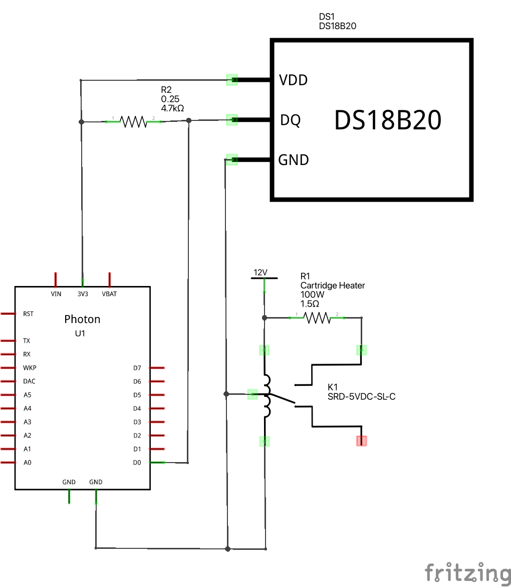
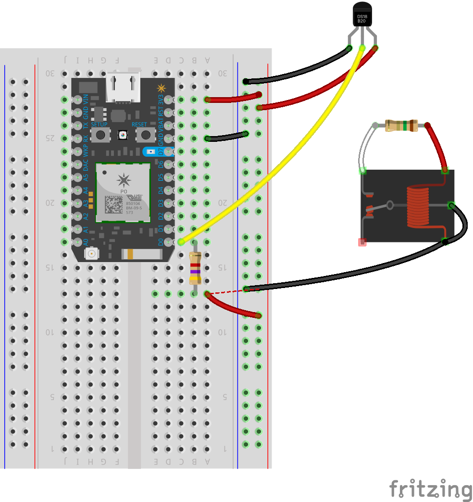

# CoffeeWarmer

> Why spend $100 on something when you can spend more and learn things?

A DIY version of the [Ember Mug](https://ember.com/) for nerds. We use a cartridge heater placed
inside the mug to heat it along with a temperature sensor that monitors the temperature of the
liquid in the mug.

## ⚠️ Safety Warning ⚠️

This project requires a cartridge heater that that draws currents of > 8A. Using this component
without the appropriate safety precations can result in serious injury or death. Please do not
try this without understanding the dangers of working with high power components.

This project was done as a hobby. No guarantees are made about the quality of the instructions,
design, or software provided. Please be careful.

## Hardware

### Bill of Materials (BOM)

| Component                         | Schematic Label | Documentation                                     | Purchase Link                                              |
| --------------------------------- | --------------- | ------------------------------------------------- | ---------------------------------------------------------- |
| Particle Photon                   | U1              | [Particle Docs](https://docs.particle.io/photon/) | https://store.particle.io/collections/wifi/products/photon |
| DS18B20 Temperature Sensor        | DS1             | [Datasheet](./docs/datasheets/DS18B20.pdf)        | https://www.adafruit.com/product/381                       |
| SRD-5VDC-SL-C Relay               | K1              | [Datasheet](./docs/datasheets/SRD-5VDC-SL-C.pdf)  | https://www.amazon.com/dp/B00LW15A4W                       |
| Dernord 12V 100W Cartridge Heater | R1              | Not Available                                     | https://www.amazon.com/dp/B0741664G5                       |
| Bench Power Supply                |                 | Not Available                                     | https://www.amazon.com/dp/B08DJ1FDXV                       |

### Schematic

This schematic diagram was made with [Fritzing](https://fritzing.org/).

Note that the connection from `D7` to the input connection on the relay is not shown. This is due to limitations on the
imported part file for the relay. `D7` was chosen so that the on-board LED could be used to indicate the desire state
of the relay.

### Breadboard

This breadboard diagram was made with [Fritzing](https://fritzing.org/).

Note that connections from the bench power supply are not shown. This is due to limitations in the Fritzing tool.
- The positive terminal should be connected to the red wire on the cartridge heater and the positive terminal
of the relay coil.
- The negative terminal should be connected to the `GND` pin of the Photon. Since the relay coil's only reference
voltage is the bench power supply, failure to make this connection will result in insufficent voltage across the
relay input. This will prevent the relay from switching even when the input is driven high from the Photon. 

